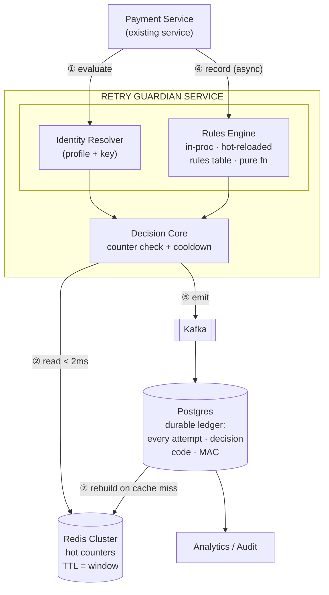

# Retry Guardian

A card authorization retry prevention service. Sits in front of the card network and makes **ALLOW / BLOCK** decisions on retry attempts, preventing scheme fines from Visa and Mastercard that are triggered when merchants retry declined transactions too aggressively.

## How it works



> Kafka, Postgres, Redis Cluster, and Analytics are planned for production. Phase 1 uses a single Redis node.

The payment service calls `/evaluate` before sending an auth request to the network. If the decision is ALLOW, it proceeds; if BLOCK, it short-circuits without touching the network. After the network responds, it calls `/record` with the outcome so the service can update retry state.

Identity is derived as `SHA-256(merchant_id | card_fingerprint | transaction_type)` — no PAN or raw card data is stored.

## Quick start

**Prerequisites:** Docker Desktop running.

```bash
# 1. Start Redis
docker compose up -d

# 2. Start the service
go run .
```

The service starts on **http://localhost:8081**.

To verify:

```bash
curl http://localhost:8081/health
curl http://localhost:8081/ready
curl http://localhost:8081/v1/internal/retry-guard/rules
```

## Configuration

| File | Purpose |
|------|---------|
| `config.toml` | Server port, Redis address, rules file path |
| `rules.yaml` | MAC rules and network code rules (loaded at boot) |

Key defaults in `config.toml`:

```toml
[server]
port = 8081

[redis]
addr = "localhost:6379"

[rules]
file_path = "rules.yaml"
```

## API

| Method | Path | Description |
|--------|------|-------------|
| `POST` | `/v1/retry-guard/evaluate` | Returns ALLOW or BLOCK before an auth attempt |
| `POST` | `/v1/retry-guard/record` | Records the outcome after an auth attempt |
| `GET` | `/v1/internal/retry-guard/rules` | Returns the active rules table |
| `GET` | `/health` | Liveness check |
| `GET` | `/ready` | Readiness check (includes Redis ping) |

### Evaluate

```json
POST /v1/retry-guard/evaluate
{
  "payment_id":       "pay_001",
  "merchant_id":      "merch_abc",
  "card_fingerprint": "fpr_xyz",
  "transaction_type": "PURCHASE",
  "network":          "VISA"
}
```

Response:

```json
{
  "decision":           "ALLOW",
  "reason":             "NO_PRIOR_DECLINE",
  "attempts_remaining": null,
  "retry_allowed_after": null
}
```

### Record

```json
POST /v1/retry-guard/record
{
  "payment_id":  "pay_001",
  "outcome":     "DECLINED",
  "authorization_data": {
    "card_network_response_code": "51",
    "merchant_advice_code":       ""
  },
  "occurred_at": "2026-07-15T10:00:00Z"
}
```

`outcome` must be `APPROVED`, `DECLINED`, or `ERROR`. `authorization_data` is required for `DECLINED`. An `APPROVED` outcome clears all retry state for that card+merchant identity.

## Decision logic

1. **No prior state** → ALLOW (`NO_PRIOR_DECLINE`)
2. **HARD_DECLINE on record** (e.g. stolen card, invalid PAN) → permanent BLOCK
3. **Cooldown active** → BLOCK (`RETRY_TOO_SOON`) with `retry_allowed_after`
4. **Count limit exceeded** (code `65`: max 4 in 16 days) → BLOCK (`RETRY_LIMIT_EXCEEDED`) with `retry_allowed_after`
5. **Window expired** → ALLOW (`WINDOW_RESET`), budget resets
6. **Within budget** → ALLOW (`WITHIN_RETRY_BUDGET`) with `attempts_remaining`

For Mastercard, a Merchant Advice Code (MAC) takes precedence over the network response code when present.

## Resetting state (local dev)

```bash
# Flush all retry state
docker exec retry-guardian-redis-1 redis-cli FLUSHALL

# Rewind a cooldown to test retry-after expiry
docker exec retry-guardian-redis-1 redis-cli HSET rg:<IDENTITY> retry_not_before 1

# Simulate 16-day window expiry for code 65
docker exec retry-guardian-redis-1 redis-cli HSET rg:<IDENTITY> first_attempt_at <unix_ts_17_days_ago>

# Find identity keys
docker exec retry-guardian-redis-1 redis-cli KEYS "rg:*"
```

Data persists across container restarts via the `redis-data` named volume and AOF. To start completely fresh:

```bash
docker compose down -v && docker compose up -d
```

## Testing

Import `retry-guardian.postman_collection.json` into Postman. The collection covers all decision paths: hard decline, cooldown, count limits, window reset, MAC override, pass-through, and approval clearing state.
